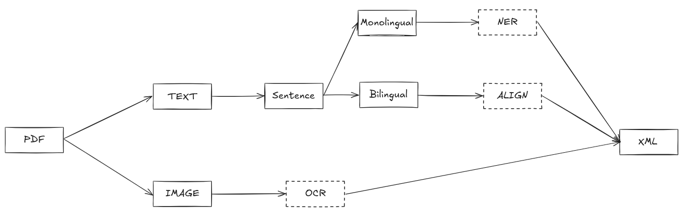

<div style="text-align: center;">
    <h2>nlp-vietnamese-phd</h2>
    <div style="display: inline-block;">
        
    </div>
</div>


## Hướng dẫn

- Cài đặt môi trường
```bash

python -m venv .venv # Nếu sử dụng conda -> conda create -n .venv python=3.10

source .venv/bin/activate

pip install .   # Đã có file pyproject.toml; không cần requirements.txt
```

_Lưu ý:_ Nên sử dụng python version 10 vì thư viện được sử dụng trong bài cho tác vụ NER, `underthesea`, chỉ tương thích với python version 10.

- Chạy chương trình

**notebook**

Do các mã nguồn đều sử dụng jupyter, vì vậy, chỉ cần cài đặt kernel sử dụng môi trường .venv.

**script**

Chưa hoàn thiện.